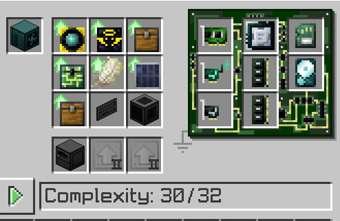
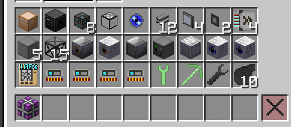
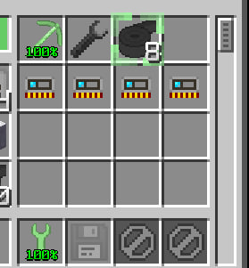
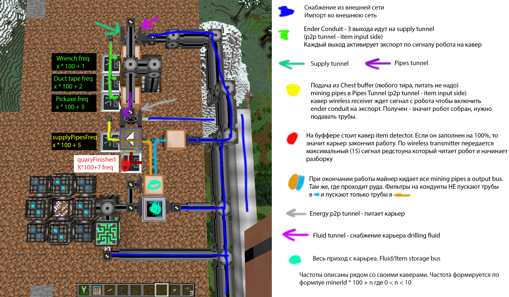

# auto-quary

Набор скриптов для автоматической работы карьера (quarry) в OpenComputers.
Скрипт управляет постройкой, запуском майнера, обслуживанием, разборкой и переходом на следующую точку.

## Состав
- `auto-quary/auto-quary.lua` — точка входа. Определяет `minerId` по имени робота и запускает майнера.
- `auto-quary/quary-scripts/run.lua` — основной сценарий работы карьера.
- `auto-quary/quary-scripts/build.lua` — сборка карьера.
- `auto-quary/quary-scripts/disassemble.lua` — разборка карьера.

## Робот и железо
Нужен робот как на скрине ниже. Обязательно должна быть установлена карточка `OcGtWireless` (из ленивых зайцев ИИС).



## Предподготовка
### Имена и карты памяти
Заранее подготовить 4 `memory card`. Каждая хранит выходную настройку P2P туннеля подсети карьера.
Обязательно переименовать:
- `Supply Tunnel <id>`
- `Pipes Tunnel <id>`
- `Fluid Tunnel <id>`
- `Energy Tunnel <id>`

`<id>` не проверяется, но удобно использовать ID робота.

Также обязательно переименовать инструмент:
- `Wrench` -> `Computer Wrench` (любой, который шифтом снимает трубы и т.п.)

Важно: майнер **обязан** называться `Miner <id>` — от Id в конце считаются частоты.

### Инструменты
В инвентаре робота должны быть:
- 4 переименованные `memory card`
- `Computer Wrench`
- греговские `wrench` и `pickaxe`
- `duct tape` x10

Примечания:
- `memory card` **нельзя класть в первую строку** инвентаря — настройки могут стираться.
- Греговский ключ (wrench) кладем в экипировку. Остальное не важно.

### Каверы и компоновка
Карьер собирается максимальный, используются все `input bus` и `hatch`.
В моей схеме на hatch-ах каверов нет. Перестановка возможна, но лучше не менять логику.

Каверы и отклонения от дефолта:
- `Ore Drilling Rig`: слева `Machine Controller` (enabled with redstone), справа `maintenance cover` (2 issue)
- `maintenance hatch`: справа `wireless transmitter`, частота `4`
- `energy hatch`: слева `wireless transmitter`, частота `8`
- `output bus`: сзади `wireless transmitter`, частота `6`
- `lv input bus`: спереди `item detector`

Если тир/номер не указан (кроме `lv input bus` и переименованных предметов), допускается любой тир.

### Материалы
- `input hatch` х1
- `output hatch` х1
- `casing` x5 — материал по тиру карьера
- `frame box` x15 — материал по тиру карьера
- `dense cable` x1
- `smart cable` x12
- `charger` x1
- `p2p tunnel (ME)` x4
- `import bus` x2
- `acceleration card` x4
- `dense energy cell` x1
- `quantum ring` x1
- `copper chest` (любой, ломаемый киркой)

### Пейлоад робота перед сборкой


### Инвентарь и инструменты


### Схема настройки подсети


## Логирование
Используется модуль `herobeni-logger`.
- Лог пишется в `/home/logs/robot.log`.
- В начале каждой итерации цикла лог очищается.

## Установка
Для установки нужен `oppm` на роботе.

Регистрация репозитория:

```bash
oppm register herobeniyoutube/herobeniyoutube-programs
```

Установка:

```bash
oppm install auto-quary
```

Апдейт:

```bash
oppm update auto-quary
```

## Запуск
На компьютере/роботе:

```lua
# из OpenOS
lua /home/auto-quary.lua x z y side [built] [loaded]
```

Аргументы:
- `x`, `z`, `y` — стартовые координаты робота.
- `side` — направление: число `0..3` или строка `south|east|north|west`.
- `built` — если передан (любое значение), считается что карьер уже построен.
- `loaded` — если передан, считается что трубы уже загружены и/или он закончил работу и вызов начнет разборку.

## Частоты (расчет)
Частоты вычисляются от `minerId`:
- `pickaxeFreq = id*100 + 1`
- `tapeFreq = id*100 + 2`
- `wrenchFreq = id*100 + 3`
- `enableMinerFreq = id*100 + 4`
- `supplyPipesFreq = id*100 + 5`
- `pipesFullFreq = id*100 + 6`
- `quaryFinished = id*100 + 7`
- `quaryNeedMaintenanceFreq = id*100 + 8`

## Ключевая логика цикла
1. Отключить майнер.
2. Построить карьер (если нужно).
3. Загрузить трубы (если нужно).
4. Включить майнер.
5. Следить за состоянием и обслуживать.
6. Выключить майнер.
7. Разобрать карьер.
8. Перейти на следующую точку.
